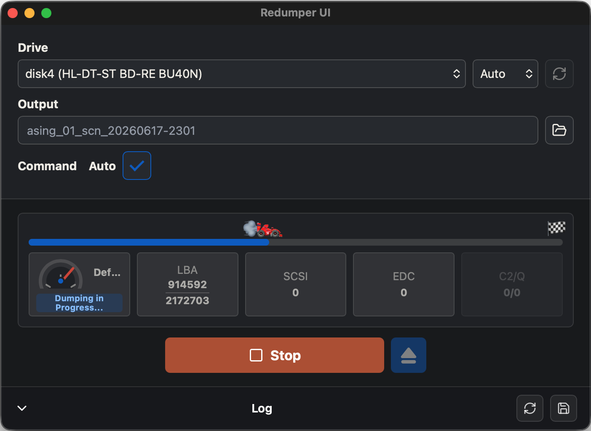
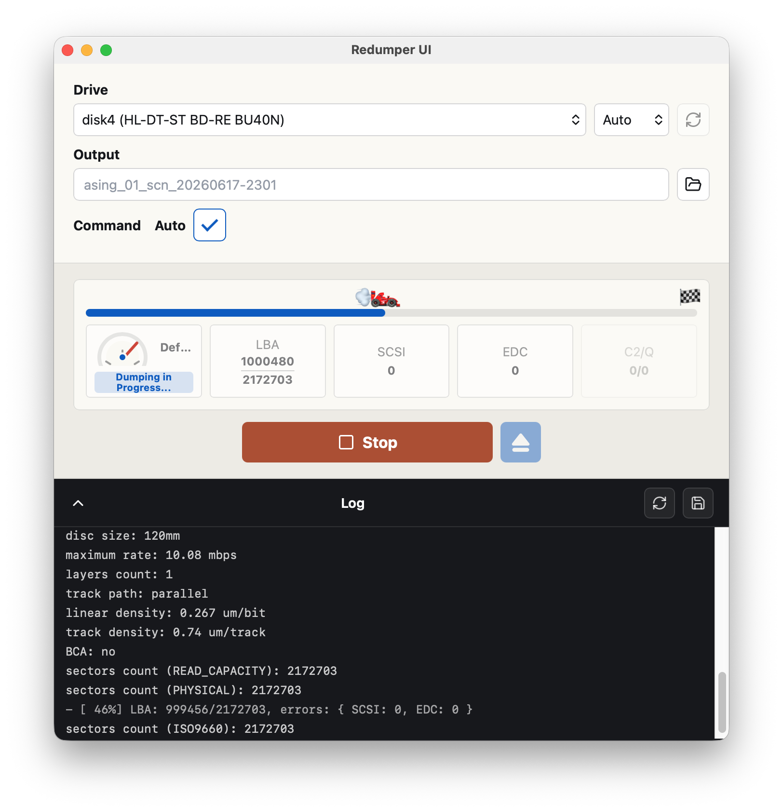

[](https://stand-with-ukraine.pp.ua)

# Redumper UI

Cross-platform desktop frontend for [`superg/redumper`](https://github.com/superg/redumper).

The app is built with Tauri v2, Rust, React, TypeScript, and Tailwind CSS. It
wraps the official redumper CLI with a typed command UI, streamed logs, and
platform-aware packaging.

## Support Ukraine

Redumper UI includes the same Ukraine support banner used by
[`superg/redumper`](https://github.com/superg/redumper), the upstream CLI app by
superg. The banner links to donation and support resources for Ukraine.

## Screenshots





## Development

```sh
npm install
npm run prepare-redumper
npm run tauri:dev
```

`prepare-redumper` downloads the pinned upstream binary for the current target
into `src-tauri/resources/redumper/`. The downloaded binaries are intentionally
not tracked in git.

## Useful Commands

```sh
npm run dev
npm run build
npm run test
npm run typecheck
npm run update-upstream
```

## Release Model

The `Check Upstream Release` workflow compares the latest upstream redumper tag
against `.redumper/upstream.json`. If it changes, the workflow updates the
manifest and app version, commits that change, and starts the cross-platform
release workflow.

Release builds target Windows x64/ARM64, macOS x64/ARM64, and Linux x64/ARM64.
The release workflow publishes draft releases in
[`whatever-industries/redumper-ui`](https://github.com/whatever-industries/redumper-ui)
and promotes the release after all matrix jobs finish.

## Licensing

This repository is GPL-compatible because release artifacts bundle upstream
redumper, which is GPL-3.0 licensed. See `NOTICE.md` for attribution.
